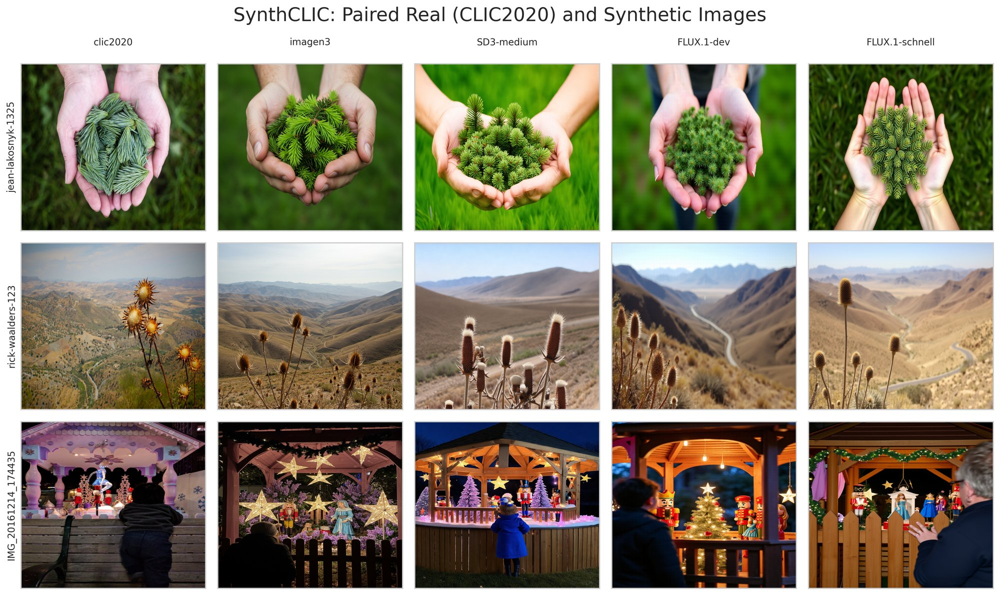
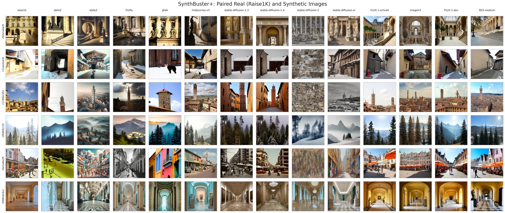

# CLIP-Cues

**Synthetic Image Detection with CLIP: Understanding and Assessing Predictive Cues**
Marco Willi, Melanie Mathys, Michael Graber · Institute for Data Science I4DS, FHNW

[](https://opensource.org/licenses/MIT)
[](https://www.python.org/downloads/)

CLIP-based detectors separate real from AI-generated photographs well, but *what* they respond to has
been unclear. This repository accompanies a paper that treats that question as an empirical
interpretability problem rather than proposing a new detector: which photographic, semantic and
forensic information in CLIP's representation supports the decision, and how far does it transfer?

The short answer, and the reason this repo is organised the way it is: the decision rests on **many
overlapping named cues, not one fingerprint**, and the cue profile belongs to the **training corpus
rather than to the task** — so a detector's explanation does not transfer between generator families
even when its accuracy partly does.

Everything here is reproducible **on a CPU in minutes**, from a frozen, checksummed set of cached
CLIP features. See [docs/REPRODUCTION.md](docs/REPRODUCTION.md).



*SynthCLIC, introduced by this paper: each row is one real photograph and its caption-matched
synthetic counterparts. Holding content roughly fixed across a row is what makes the paired cue
analysis possible.*

## Install

```bash
git clone https://github.com/marco-willi/clip-cues.git && cd clip-cues
uv sync --extra all          # CPU PyTorch by default; ~1.7 GB
```

Plain pip works too (`pip install -e ".[all]"`, or `pip install -r requirements.txt` for pinned
versions). A GPU is needed only to extract embeddings from images — see
[docs/REPRODUCTION.md](docs/REPRODUCTION.md#gpu-steps).

A devcontainer is provided: the default configuration is CPU-only; `.devcontainer/gpu/` adds
`--gpus=all` and the CUDA wheels. `make help` lists every task in the repository.

## Quick start

```python
from clip_cues import load_clip_classifier

# the canonical detector: a single logistic direction in frozen CLIP ViT-L/14-336 features
model = load_clip_classifier("data/checkpoints/linear_probe_synthclic.ckpt")

prob = model.predict("path/to/image.jpg")
print(f"P(synthetic) = {prob:.1%}")
```

```python
probs = model.predict_batch(["a.jpg", "b.jpg", "c.jpg"], batch_size=32)
```

`examples/inference_demo.py` runs the same thing over a file, a list or a directory, and
`examples/` also has two worked notebooks, for the linear probe and the concept model.

## What the models are

The paper's inventory is deliberately small. One detector, two analysis objects derived from it, and
one separate classifier:

| object | checkpoints | what it is |
| --- | --- | --- |
| **`D_h`** — the canonical detector | `linear_probe_*.ckpt` | one logistic direction in the 1024-d pre-projection CLIP representation. Every headline detection number and every interpretation target refers to this. |
| **`D_e`** — shared-space analysis head | *(rebuilt, not shipped)* | the same recipe on the 768-d image–text space. It exists only because a 1024-d direction cannot be compared with text directions; it is **not** a detector to deploy. |
| **`D_cue`** — cue-restricted probe | *(rebuilt, not shipped)* | the same recipe on 168 named cue scores. Measures how much label information the vocabulary carries. |
| k=8 factorized head | `clip_orthogonal_*.ckpt` | a **diagnostic ablation**. Its effective boundary is stable across seeds (Σ-cos 0.963); its individual axes are not (matched \|cos\| 0.289, cue-profile ρ 0.119), so per-axis interpretations are not reproducible and should not be made. |
| concept model | `cm_antonyms_*.ckpt` | a separate, intrinsically text-grounded classifier over the 168 antonym cue pairs — complementary evidence, not an explanation of `D_h`. |

Each family has four checkpoints, one per training corpus (SynthCLIC, SynthBuster+, CNNSpot,
combined). Details and provenance: [data/checkpoints/README.md](data/checkpoints/README.md).

Nesting `D_h → D_e → D_cue` gives the cost of each restriction, on SynthCLIC:

| | AUROC | change |
| --- | --- | --- |
| `D_h` — canonical detector | 0.921 | — |
| `D_e` — after CLIP's projection | 0.893 | −0.029 [−0.021, −0.037] |
| `D_cue` — restricted to 168 named cues | 0.834 | −0.059 [−0.075, −0.043] |

The named vocabulary is therefore incomplete but recovers most of what the shared space carries
(excess recovery 0.85).

## Datasets

```python
from datasets import load_dataset

synthclic   = load_dataset("marco-willi/synthclic")        # CLIC photographs + SD3/FLUX/Imagen3
synthbuster = load_dataset("marco-willi/synthbuster-plus")  # RAISE + 9 latent-diffusion models, extended
cnnspot     = load_dataset("marco-willi/cnnspot-small")     # the GAN-heavy Wang et al. benchmark
```

**SynthCLIC** is introduced by this paper: real photographs from the CLIC challenge paired with
caption-matched synthetic counterparts from Imagen 3, FLUX (dev and schnell) and Stable Diffusion 3
Medium, matched to each real image's aspect ratio — the collage at the top of this page.

**SynthBuster+** extends the SynthBuster dataset — RAISE photographs paired with nine latent
diffusion models — with images from four more recent generators, to reflect current generative
quality. The real half is older and less diverse than SynthCLIC's, which is exactly why both corpora
are needed: a detector's cue profile turns out to depend on which one it was trained on.



### Generation prompts

The synthetic halves are conditioned on descriptions of each real photograph, produced by a
vision-language model. Both prompt sets ship here:
[SynthCLIC](data/datasets/synthclic/synthclic_prompts.parquet) ·
[SynthBuster+](data/datasets/synthbuster-plus/synthbuster_plus_prompts.parquet).


*Real CLIC photographs with the descriptions derived from them; those descriptions are what the
generators were conditioned on. The equivalent for RAISE / SynthBuster+ is
[here](docs/images/synthbuster_raise1k_real_images_with_prompts.jpg).*

## Cue vocabulary

168 antonym pairs of photographic and perceptual attributes (*sharp detail ↔ blurry detail*), each
embedded as a signed direction in CLIP's shared space. Fixed in advance and not optimized for
detection.

📄 [data/vocabularies/antonyms.csv](data/vocabularies/antonyms.csv)

## Reproducing the paper

Frozen CLIP means the expensive step happens once: extract embeddings on a GPU, cache them, then
every analysis is a linear head on cached features.

```bash
make finalexp-fetch     # download the checksummed input snapshot (~290 MB) and verify it
make finalexp-all       # F1-F7: the full methodological consolidation, CPU, a few minutes
make figures-all        # rebuild the figure set (Figs 3/4/8 need the HF image cache)
uv run pytest tests/    # the tests that pin the science
```

`finalexp-fetch` verifies every file against its sha256 before anything loads it, so a corrupted
download fails loudly rather than silently changing a result.

- **[docs/REPRODUCTION.md](docs/REPRODUCTION.md)** — the matched training recipe, what runs on CPU
  versus GPU, expected wall times, and the two results that need a GPU re-extraction.
- **[docs/EXPERIMENTS.md](docs/EXPERIMENTS.md)** — the two experiment series, F1–F7 and the
  E-experiments, and what each is evidence for.
- **[reproduction/](reproduction/README.md)** — everything for reproducing the paper: the experiment
  ledger, the F1–F7 records, the figure ledger and the configs.
- **[reproduction/experiments/figures/README.md](reproduction/experiments/figures/README.md)** — every figure's claim, source
  and **required caption caveats**.

Rendered figures are build outputs and are not tracked here; the exact plotted data (`.csv`) and the
generated captions are, so any number in a figure can be checked without rebuilding it.

**Before you build a table from this data**, three things will otherwise give you a plausible wrong
answer: "mAP" means pooled AP in the code but per-generator mean AP in the paper's tables; CNNSpot
has two evaluation frames (4,000-image and 108,310-image) and its `source` column names an
evaluation subset rather than a generator; and one class of cached cue embedding is retracted but
shape-identical to the correct one. Each is documented where it applies —
[`reproduction/experiments/data/`](reproduction/experiments/data/) for the artifacts and
`EXCLUDED.md` for the retraction, the figure ledger for per-figure caveats.

## Repository map

```
src/clip_cues/              the installable package: frozen CLIP backbone, the heads, inference
src/clip_cues_research/     the reproduction layer — hash-verifying loaders, the matched trainer,
                            one module per figure. In a source checkout, not in the wheel.
scripts/                    thin drivers; `make help` is the real index
reproduction/               configs, the experiment ledger, the F1–F7 records with their
                            run_meta.json provenance, and the input snapshot's manifest
data/                       the twelve checkpoints, the 168-pair cue vocabulary, generation prompts
docs/                       reproduction recipe, experiments, pitfalls
examples/                   inference demo, two worked notebooks, sample images
tests/                      the guards that pin the science, not style checks
```

The split between the two `src/` packages is the load-bearing one: `clip_cues` is what
`pip install` gives you and what the checkpoints need, while `clip_cues_research` exists only to
reproduce the paper and ships in the repository alone.

Not everything lives in git — the release is three tiers:

| tier | what | where |
| --- | --- | --- |
| this repository | code, configs, tests, checkpoints, vocabulary, prompts, experiment records, figure data | git (~35 MB) |
| fetched on demand | the frozen input snapshot: cached CLIP features, cue scores, the projection matrix, reference anchors (~290 MB) | [`clip-cues-artifacts`](https://huggingface.co/datasets/marco-willi/clip-cues-artifacts) — `make finalexp-fetch` |
| the images themselves | SynthCLIC, SynthBuster+, CNNSpot | [`synthclic`](https://huggingface.co/datasets/marco-willi/synthclic) · [`synthbuster-plus`](https://huggingface.co/datasets/marco-willi/synthbuster-plus) · [`cnnspot-small`](https://huggingface.co/datasets/marco-willi/cnnspot-small) |

Rendered figures, raw run outputs and the image datasets are deliberately absent. What each snapshot
artifact is, its sha256 and which experiments consume it:
[`reproduction/experiments/data/MANIFEST.md`](reproduction/experiments/data/MANIFEST.md).

## Citation

```bibtex
@article{willi2026synthetic,
  title   = {Synthetic Image Detection with {CLIP}: Understanding and Assessing Predictive Cues},
  author  = {Willi, Marco and Mathys, Melanie and Graber, Michael},
  year    = {2026}
}
```

## License

MIT — see [LICENSE](LICENSE). This covers the code, the checkpoints, the vocabulary and the derived
feature arrays; the photographs the datasets are built from remain subject to their own licenses.

## Acknowledgments

[OpenAI CLIP](https://github.com/openai/CLIP) · [HuggingFace Transformers](https://huggingface.co/transformers) ·
CNNSpot ([Wang et al., 2020](https://github.com/peterwang512/CNNDetection)) ·
SynthBuster ([Bammey, 2023](https://ieeexplore.ieee.org/document/10334046/)) ·
CommunityForensics ([Park & Owens, 2025](https://arxiv.org/abs/2411.04125))
